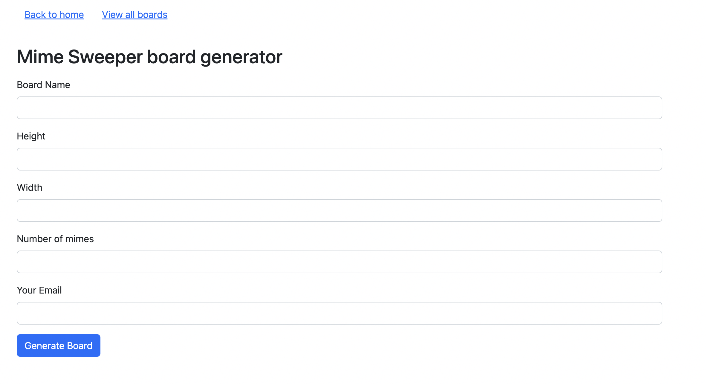
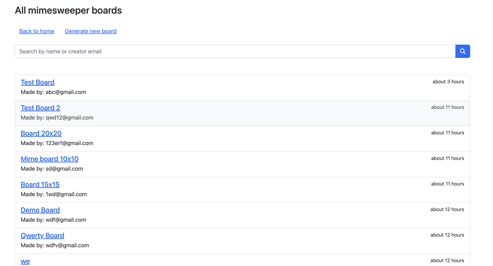

#### Mimesweeper board genertor
> This scope of respository is for generating the mimesweeper board
> You are required to input height, width, number of mimes, name and your email then the system will generate the board.
> The board will be a matrix with size: height x width cells

## URL Heroku:
```
https://mimesweeper.herokuapp.com
```
## Framework and dependencies
* Ruby 3.1.2
* Rails 7.0.4
* Database: Postgresql
* Node.js: 16.19

## Local set up
* Clone project repository.
```shell
git clone git@github.com:nvtin/mimesweeper.git
```
* Go to project folder
```shell
cd mimesweeper
```
* run bundle
```
bundle install # to install gem package
yarn install # to install javascript libraries
```
* Copy database file from example
```shell
cp config/database.yml.sample config/database.yml
```
* Prepare database
```shell
rails db:create # create new database
rails db:migrate # Migrate database based on migration files
```
* Run tests Rspec
```shell
rspec . # run rspec for all files
```
To run specify file, we can run
```
rspec spec/controllers/boards_controller_spec.rb
```
* Start server for application
```shell
rails server
```

  Default port will be: 3000
* Locally url:
```
http://localhost:3000
```

Some screen shots:



